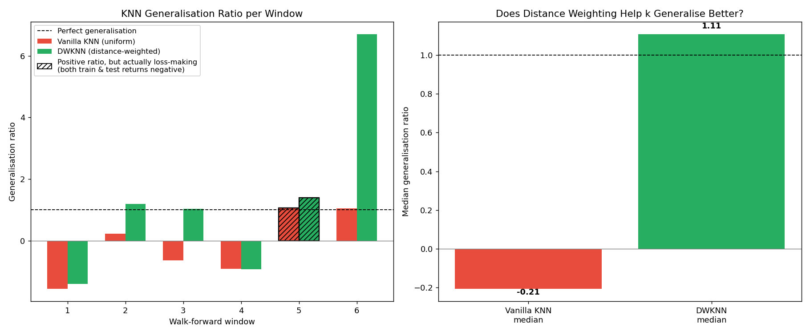

# Does KNN's k Overfit Too? A Follow-Up to the Overfitting Trap

*A distance-weighted KNN strategy on an Emerging Markets Asia ETF*

## Why this project

My first project demonstrated overfitting on a very simple, rule-based
trading strategy (a moving-average crossover with two parameters). That
naturally raised a broader question: is this a quirk of that specific
rule, or does the same trap show up in a proper machine learning model?

K-Nearest Neighbours was the first algorithm I studied in detail in a
machine learning course, and it happens to have a well-known weakness
that maps almost exactly onto what I'd just found: the choice of k is
itself a parameter that can be overfit, in the same spirit as the
moving-average windows in my first project. I wanted to test that
directly, using the exact same walk-forward methodology, rather than
just assume the conclusion carries over.

The literature on distance-weighted KNN (DWKNN), notably applied to
exchange rate forecasting in emerging markets, suggests that weighting
neighbours by inverse distance should make predictions less sensitive
to the choice of k. That gave me a second, more specific question: does
a theoretically motivated fix actually hold up in a strict walk-forward
setting, on real EM Asia data (AAXJ) — or does it fail the way my
first project's correction attempt did?

## What this project does

1. Builds a KNN regression strategy: for each day, predict the next
   day's return using 3 features (5-day return, 20-day return, 20-day
   volatility), go long if the prediction is positive, stay flat
   otherwise (no shorting — consistent with my own PEA strategy).
2. Selects k "naively": for each walk-forward window, split the
   training period into a sub-train/sub-validation split, pick the k
   that performs best on that validation slice — a realistic mistake
   (no proper cross-validation).
3. Tests the selected k on the genuinely unseen out-of-sample window.
4. Repeats this across 6 rolling walk-forward windows on real AAXJ
   data (2016–2024), with transaction costs included.
5. Compares vanilla KNN (uniform weighting) against DWKNN
   (distance-weighted) using the same generalisation ratio and
   mean/median methodology as the first project.

## What I found

### This time, the correction actually worked

Unlike my first project — where averaging the top-5 parameter
combinations made things worse, not better — here the theoretically
motivated fix (distance weighting) genuinely improved generalisation:

| | Mean | Median | Std dev | Negative windows |
|---|---|---|---|---|
| Vanilla KNN | -0.13 | -0.21 | 1.08 | 4/6 |
| **DWKNN** | 1.33 | **1.11** | 2.88 | 3/6 |

The DWKNN's median generalisation ratio (1.11) sits essentially at — or
slightly above — the "perfect generalisation" line. Vanilla KNN's
median stays clearly negative.

I checked whether this DWKNN result was itself outlier-driven, the same
way the naive MA crossover method was in my first project. It is: window
6's ratio (6.70) pulls the DWKNN mean from 0.25 (without that window) up
to 1.33 (with it) — a distortion of the same kind, and roughly the same
size, as the one I found before. The median, however, barely moves
(1.03 without window 6 vs. 1.11 with it), which is exactly why I trust
it more than the mean here. This is a useful confirmation of the
lesson from my first project: it's not that DWKNN "produces no
outliers" — it's that the median is the right statistic to read
regardless of which method you're evaluating.



### An important caveat: a ratio above 1 isn't automatically good news

While checking these results, I noticed something worth flagging
explicitly. Window 5's DWKNN generalisation ratio is **1.39** — which
looks great at first glance — but both the training return (-8.9%) and
the test return (-12.4%) were *negative*. Dividing two negative numbers
gives a positive ratio, even though the strategy lost money on both
sides. A generalisation ratio has to be read together with the sign and
magnitude of the underlying returns, never in isolation — otherwise a
losing strategy can masquerade as "well-generalised."

### A necessary caveat on sample size

With only 6 walk-forward windows — even fewer than the 7 in my first
project — any conclusion here is fragile. One extra or missing window
could shift both the mean and, to a lesser extent, the median. I'd
treat this result as a genuine, honestly-obtained signal that DWKNN
generalises better here, not as a statistically robust proof.

### Ratio vs. Sharpe: two different questions, two different answers

The generalisation ratio answers "did performance carry over proportionally
from training to test?" It doesn't answer "was the out-of-sample
performance actually any good?" I computed Sharpe ratios to check the
second question directly.

| | Train Sharpe (mean) | Test Sharpe (mean) | Positive test-Sharpe windows |
|---|---|---|---|
| Vanilla KNN | 1.69 | -0.58 | 0/6 |
| DWKNN | **9.92** | -0.35 | 3/6 |

DWKNN's training Sharpe is absurdly high — individual windows reach
8 to 11, a level no real strategy sustains — which is itself a clear
overfitting signature, just visible through a different lens than the
generalisation ratio. And despite DWKNN's median generalisation ratio
looking close to "perfect" (1.11), its **out-of-sample Sharpe is still
negative on average** (-0.35). Vanilla KNN is worse still: negative
test Sharpe in every single window.

The honest conclusion: DWKNN is a real improvement over vanilla KNN —
less bad training-set overfitting, and 3 out of 6 windows turn
risk-adjusted-positive out-of-sample instead of zero — but it has not
been "solved." A generalisation ratio near 1 means the model's
(mediocre) performance carried over consistently, not that the
strategy is genuinely profitable out-of-sample. Ratio and Sharpe are
answering different questions, and a project should check both before
declaring a fix successful.

### Contrast with the first project — and why that's a good thing

The headline finding here is almost the mirror image of my first
project's conclusion, with a caveat the Sharpe check above adds: a
theoretically motivated fix (distance weighting) measurably improved
things here, while a more ad-hoc one (parameter averaging) didn't work
in the first project — but "improved" is not the same as "solved," as
the negative average test Sharpe shows. I think that contrast, and the
discipline of checking both the ratio and the Sharpe rather than
stopping at the first flattering number, is the most useful part of
doing both projects rather than just one: it shows I'm not assuming
corrections work (or don't), and I don't stop checking once I get an
answer I like.

## Methodology notes

- Data: daily closing prices via `yfinance`, ticker `AAXJ`, 2016–2024.
- Features: 5-day return, 20-day return, 20-day realised volatility —
  computed from daily prices, which consumes the first ~20 days of
  history (hence 6 walk-forward windows here vs. 7 in the MA crossover
  project on the same underlying data).
- Walk-forward setup: 500-day training windows, 250-day non-overlapping
  test windows. Within each training window, an 80/20 sub-train/
  sub-validation split is used for the naive k selection, to avoid the
  degenerate case of KNN evaluating itself on its own training points
  (which trivially favours the smallest possible k).
- k grid tested: 3, 5, 7, 10, 15, 20, 30, 40, 50.
- Transaction costs: 10 bps charged on every position change.
- Strategy: long-only, no shorting.

## What I'd extend next

- Test whether the DWKNN advantage holds on other assets, or whether
  it's specific to AAXJ's price dynamics over this period.
- Try a proper k-fold cross-validation within each training window
  instead of a single 80/20 split, to see if that changes the naive
  selection's stability.
- Combine this with the MA crossover project: build an ensemble that
  only trades when both strategies agree, and check whether that
  agreement filter improves the generalisation ratio further.

## How to run

```bash
pip install -r requirements.txt
python knn_overfitting.py
```

## References

- Distance-weighted KNN literature applied to exchange rate forecasting
  in emerging markets (weighting by inverse distance to reduce
  sensitivity to k).
- Sheppert, A. P. (2026). The GT-Score: A Robust Objective Function for
  Reducing Overfitting in Data-Driven Trading Strategies. *Journal of
  Risk and Financial Management*, 19(1), 60. — the paper that inspired
  the original walk-forward / generalisation ratio methodology reused
  here.

