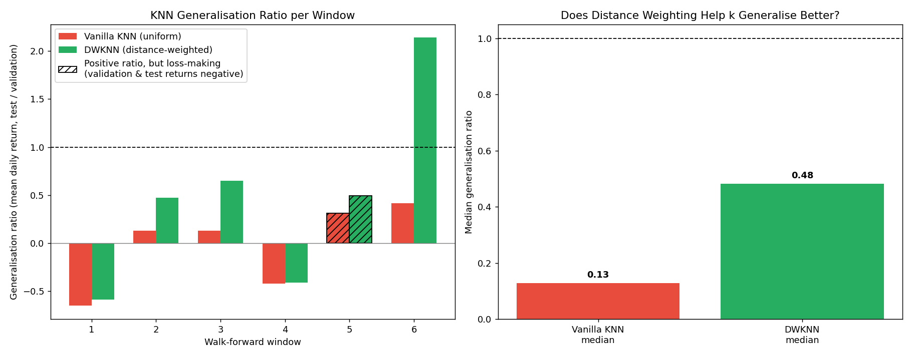

# Does KNN's k Overfit Too? A Follow-Up to the Overfitting Trap

*A distance-weighted KNN strategy on an Emerging Markets Asia ETF*

## Why this project

My first project demonstrated overfitting on a very simple, rule-based
trading strategy (a moving-average crossover with two parameters). That
naturally raised a broader question: is this a quirk of that specific
rule, or does the same trap show up in a proper machine learning model?

K-Nearest Neighbours was the first algorithm I studied in detail in a
machine learning course, and it happens to have a well-known weakness
that maps almost exactly onto what I'd just found: the choice of k is
itself a parameter that can be overfit, in the same spirit as the
moving-average windows in my first project. I wanted to test that
directly, using the exact same walk-forward methodology, rather than
just assume the conclusion carries over.

The literature on distance-weighted KNN (DWKNN), notably applied to
exchange rate forecasting in emerging markets, suggests that weighting
neighbours by inverse distance should make predictions less sensitive
to the choice of k. That gave me a second, more specific question: does
a theoretically motivated fix actually hold up in a strict walk-forward
setting, on real EM Asia data (AAXJ) — or does it fail the way my
first project's correction attempt did?

## What this project does

1. Builds a KNN regression strategy: for each day, predict the next
   day's return using 3 features (5-day return, 20-day return, 20-day
   volatility), go long if the prediction is positive, stay flat
   otherwise (no shorting — consistent with my own PEA strategy).
2. Selects k "naively": for each walk-forward window, split the
   training period into a sub-train/sub-validation split, pick the k
   that performs best on that validation slice — a realistic mistake
   (no proper cross-validation).
3. Tests the selected k on the genuinely unseen out-of-sample window.
4. Repeats this across 6 rolling walk-forward windows on real AAXJ
   data (2016–2024), with transaction costs included.
5. Compares vanilla KNN (uniform weighting) against DWKNN
   (distance-weighted) using a generalisation ratio (mean daily net
   return, test / validation) and the same mean/median methodology as
   the first project.

## What I found

> **Corrections (October 2026).** An earlier version of this project
> reported much stronger results for DWKNN (median ratio 1.11, training
> Sharpe 9.92). While re-checking my own code, I found two bugs, both
> described in [Corrections](#corrections) below. All figures on this
> page come from the corrected script.

### Distance weighting helped, but only partially

Unlike my first project, where averaging the top-5 parameter
combinations made things worse, here the theoretically motivated fix
(distance weighting) did improve generalisation. It did not remove the
overfitting.

| | Mean | Median | Std dev | Loss-making test windows |
|---|---|---|---|---|
| Vanilla KNN | -0.02 | 0.13 | 0.43 | 4/6 |
| **DWKNN** | 0.46 | **0.48** | 0.97 | 3/6 |

The ratio compares mean daily net returns, test over validation, so 1.0
means the validation performance carried over unchanged. Vanilla KNN
keeps only about an eighth of it out of sample. DWKNN keeps about half.
Both selected values of k are therefore overfit to the validation slice;
distance weighting reduces the damage, it does not prevent it.

I checked whether the DWKNN result was itself outlier-driven, the same
way the naive MA crossover method was in my first project. Window 6's
ratio (2.14) pulls the DWKNN mean from 0.12 (without that window) up to
0.46 (with it). The median barely moves (0.47 without window 6 vs. 0.48
with it), which is why I read the median rather than the mean, whichever
method I am evaluating.



### A positive ratio isn't automatically good news

In window 5, both models show a positive ratio (0.31 for vanilla KNN,
0.49 for DWKNN), but for DWKNN both the validation return (-8.9%) and
the test return (-12.4%) were *negative*. Dividing two negative numbers
gives a positive ratio, even though the strategy lost money on both
sides. These windows are hatched on the chart. A generalisation ratio
has to be read together with the sign of the underlying returns, never
in isolation.

### A necessary caveat on sample size

With only 6 walk-forward windows, even fewer than the 7 in my first
project, any conclusion here is fragile. One extra or missing window
could shift both the mean and, to a lesser extent, the median. I treat
this result as an honestly obtained signal that DWKNN generalises better
here, not as a statistically robust proof.

### Ratio vs. Sharpe: two different questions, two different answers

The generalisation ratio answers "did performance carry over from
validation to test?" It doesn't answer "was the out-of-sample
performance actually any good?" I computed annualised Sharpe ratios,
net of costs and of a 2.5% risk-free rate, to check the second question.

| | In-sample Sharpe (mean) | Test Sharpe (mean) | Positive test-Sharpe windows |
|---|---|---|---|
| Vanilla KNN | 0.90 | -0.58 | 0/6 |
| DWKNN | 0.89 | -0.35 | 3/6 |

Both models look reasonable in-sample and turn negative out of sample.
Vanilla KNN's test Sharpe is negative in every window; in two of them
(windows 2 and 6) the strategy still made a small profit, but not enough
to beat the risk-free rate. DWKNN turns risk-adjusted-positive in 3 of
6 windows, but its average test Sharpe is still negative (-0.35).

The honest conclusion: DWKNN is a real improvement over vanilla KNN,
but it has not been "solved". Ratio and Sharpe answer different
questions, and a project should check both before declaring a fix
successful.

### Corrections

Two bugs in the first version of the script inflated the DWKNN results.

1. **Look-ahead in the in-sample Sharpe.** The model was refit on the
   full training window, then evaluated on the last 20% of that same
   window, i.e. on points it had already seen. Each point was its own
   nearest neighbour at distance zero, so with distance weighting the
   prediction was exactly the true next-day return. That produced the
   "absurd" training Sharpe of 9.92 that I had read as an overfitting
   signature: it was a bug, not overfitting. The in-sample Sharpe is
   now computed on the validation series actually used to select k
   (DWKNN: 0.89).
2. **Horizon mismatch in the generalisation ratio.** The ratio divided a
   cumulative return over 250 test days by a cumulative return over 100
   validation days, so identical daily performance gave a ratio of
   about 2.5, not 1. The ratio now compares mean daily net returns.

Fixing them brought the DWKNN median ratio down from 1.11 to 0.48 and
the vanilla median from -0.21 to 0.13. The test Sharpe ratios and the
count of loss-making windows were not affected.

### Contrast with the first project

A theoretically motivated fix (distance weighting) measurably improved
things here, while a more ad hoc one (parameter averaging) did not work
in my first project. But "improved" is not the same as "solved", as the
negative average test Sharpe shows. The other lesson is about my own
process: the first version of this project reported a flattering
result that came partly from my own bugs. Checking the ratio and the
Sharpe, the median and the mean, and finally my own code, is the most
useful habit I took from doing both projects.

## Methodology notes

- Data: daily closing prices via `yfinance`, ticker `AAXJ`, 2016–2024.
- Features: 5-day return, 20-day return, 20-day realised volatility —
  computed from daily prices, which consumes the first ~20 days of
  history (hence 6 walk-forward windows here vs. 7 in the MA crossover
  project on the same underlying data).
- Walk-forward setup: 500-day training windows, 250-day non-overlapping
  test windows. Within each training window, an 80/20 sub-train/
  sub-validation split is used for the naive k selection, to avoid the
  degenerate case of KNN evaluating itself on its own training points
  (which trivially favours the smallest possible k).
- k grid tested: 3, 5, 7, 10, 15, 20, 30, 40, 50.
- Transaction costs: 10 bps charged on every position change.
- Generalisation ratio: mean daily net return on the test window divided
  by mean daily net return on the validation slice used to select k.
- Sharpe ratios: annualised (252 days), net of costs, with a 2.5%
  risk-free rate.
- Strategy: long-only, no shorting.

## What I'd extend next

- Test whether the DWKNN advantage holds on other assets, or whether
  it's specific to AAXJ's price dynamics over this period.
- Try a proper k-fold cross-validation within each training window
  instead of a single 80/20 split, to see if that changes the naive
  selection's stability.
- Combine this with the MA crossover project: build an ensemble that
  only trades when both strategies agree, and check whether that
  agreement filter improves the generalisation ratio further.

## How to run

```bash
pip install -r requirements.txt
python knn_overfitting.py
```

## References

- Distance-weighted KNN literature applied to exchange rate forecasting
  in emerging markets (weighting by inverse distance to reduce
  sensitivity to k).
- Sheppert, A. P. (2026). The GT-Score: A Robust Objective Function for
  Reducing Overfitting in Data-Driven Trading Strategies. *Journal of
  Risk and Financial Management*, 19(1), 60. — the paper that inspired
  the original walk-forward / generalisation ratio methodology reused
  here.

